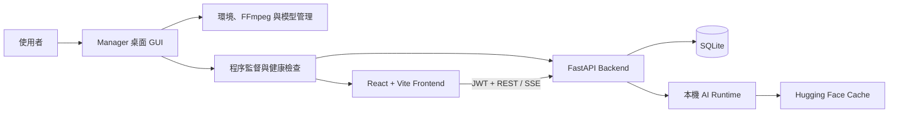

# Omni AI Manager

[](https://github.com/zx90316/Omni-AI-GUI/actions/workflows/ci.yml)
[](LICENSE)
[](https://www.python.org/)
[](https://react.dev/)

Windows 優先的本機多模態 AI 工作台。Omni AI Manager 將模型安裝、服務監督、語音辨識、文件 OCR、以圖搜頁與語意分析整合在一個桌面管理器和 Web 介面中；模型權重由 Manager 明確下載，Backend 推論時保持 local-only，避免操作功能時意外下載大型模型。

> 專案目前定位為可信任工作站或受控區域網路服務，不是已完成隔離、配額、稽核與高可用設計的公開多租戶 SaaS。公開部署前請先閱讀 [安全政策](SECURITY.md) 與 [架構文件](docs/ARCHITECTURE.md)。

## 功能

| 領域 | 能力 |
| --- | --- |
| 語音 | 本機／YouTube／上傳媒體 ASR、片段範圍選取、Forced Alignment、語者分離、繁簡轉換、字幕編修與 SRT/VTT/TXT/JSON 匯出 |
| 視覺 | GLM-OCR 圖片與 PDF 辨識、表格／公式／資訊抽取、形近字修正、OCR 模型卸載 |
| 檢索 | CLIP 圖像特徵擷取、PDF 頁面相似度搜尋、Top-1 頁面接續 OCR workflow |
| 語意 | BGE-M3 embedding 與 BGE Reranker v2 M3 重排序 |
| 管理 | Python/Node/FFmpeg 環境建立、GPU/PyTorch 平台偵測、模型快取驗證與下載、Backend/Frontend 健康檢查、自動重啟、持久化日誌 |
| 存取 | 訪客工作區或 Email OTP 登入、JWT 擁有者隔離；推論端點皆需驗證 |

## 系統架構



Manager 是生命週期擁有者；Backend 不會自行下載缺少的模型。完整元件責任、任務狀態與資料流請見 [架構文件](docs/ARCHITECTURE.md)。

## 系統需求

- Windows 10/11（主要支援與打包目標）
- Python 3.10–3.13；建議 Python 3.12
- Node.js 20 以上與 npm
- Git
- NVIDIA GPU 為選配；大型模型建議使用 CUDA，CPU 模式速度與可用功能依模型而異
- 足夠磁碟空間存放 Python 套件、前端依賴與多個 Hugging Face 模型 snapshot

FFmpeg 可由 Manager 偵測／下載，也可預先安裝在系統 `PATH`。

## 快速開始

```powershell
git clone https://github.com/zx90316/Omni-AI-GUI.git
Set-Location Omni-AI-GUI
python launch.py
```

第一次啟動後，在 Manager 依序完成：

1. 建立或修復 `.venv`，安裝 Python 與 Frontend 依賴。
2. 開啟環境設定，填入必要值並儲存 `.env`。
3. 在模型頁下載所需功能的模型；語者分離需要已取得授權的 Hugging Face Token。
4. 啟動 Backend 與 Frontend，再從 Manager 開啟 Web 工作台。

Manager 會優先使用專案內 `.python-runtime`、執行中的 Python、Windows `py -3.12` 或系統 Python。虛擬環境會記住建立它的基礎 Python 路徑，因此搬移專案或移除 Python 後應由 Manager 重建 `.venv`，不要複製舊環境到另一台電腦。

## 手動開發啟動

```powershell
py -3.12 -m venv .venv
.\.venv\Scripts\python.exe -m pip install --upgrade pip
.\.venv\Scripts\python.exe -m pip install -r requirements.txt

Copy-Item .env.example .env
# 編輯 .env，至少替換 SECRET_KEY 與 SMTP 範例值

Set-Location frontend
npm.cmd ci
Set-Location ..

# Terminal 1
.\.venv\Scripts\python.exe -m uvicorn backend.app:app --host 0.0.0.0 --port 8000

# Terminal 2
Set-Location frontend
$env:BACKEND_PORT = "8000"
npm.cmd run dev -- --host localhost --port 5173
```

開啟 <http://localhost:5173>。Backend health endpoints 為 `/health/live` 與 `/health/ready`，OpenAPI UI 為 <http://localhost:8000/docs>。實際 Manager 連接埠由 `manager_config.json` 決定，可能與上述開發預設值不同。

詳細步驟、CPU/CUDA 安裝差異與常見錯誤請見 [開發指南](docs/DEVELOPMENT.md)；所有環境變數請見 [設定參考](docs/CONFIGURATION.md)。

## 模型與資源

| 功能 | 模型 |
| --- | --- |
| ASR | `Qwen/Qwen3-ASR-1.7B-hf` 或 `Qwen/Qwen3-ASR-0.6B-hf` |
| Forced Alignment | `Qwen/Qwen3-ForcedAligner-0.6B-hf` |
| 語者分離 | `pyannote/speaker-diarization-community-1`（gated） |
| CLIP | `openai/clip-vit-large-patch14` |
| Embedding | `BAAI/bge-m3` |
| Reranking | `BAAI/bge-reranker-v2-m3` |
| OCR | `zai-org/GLM-OCR` |
| OCR Layout | `PaddlePaddle/PP-DocLayoutV3_safetensors` |

模型只在使用 Manager 執行明確下載時連網；下載完成後，Backend 以本機 cache 驗證 snapshot、權重與必要分片。模型授權與使用限制由各上游模型條款決定，不因本專案採 MIT 而改變。

## 建置與測試

Frontend production build：

```powershell
Set-Location frontend
npm.cmd ci
npm.cmd run build
```

Python 語法與離線單元測試：

```powershell
.\.venv\Scripts\python.exe -m compileall -q backend manager tests launch.py
.\.venv\Scripts\python.exe -m unittest -v `
  tests.test_manager_lifecycle `
  tests.test_model_management `
  tests.test_semantic_engine `
  tests.test_glmocr `
  tests.test_asr_stability `
  tests.test_asr_api
```

`tests/test_auth.py` 與 `tests/test_email.py` 是需要執行中 Backend／SMTP 的手動整合腳本，不屬於離線單元測試。測試分層與 GPU 驗收項目詳見 [開發指南](docs/DEVELOPMENT.md#測試策略)。

## 專案結構

```text
backend/                 FastAPI、任務路由、資料庫與 AI engines/providers
frontend/                React 19 + Vite Web 工作台
manager/                 ttkbootstrap GUI、環境／模型／程序管理
tests/                   離線單元測試與手動整合腳本
docs/                    架構、設定、開發、發布與研究報告
.github/                 CI、Dependabot、Issue 與 PR templates
launch.py                Manager 啟動／打包入口
release.bat              Windows Manager 建置與 GitHub Release 腳本
requirements*.txt        Runtime、OCR 與開發依賴
manager_config.json      Manager 本機服務與監督設定
```

`.env`、`.venv/`、`.manager/`、`uploads/`、`results/`、資料庫、模型 cache、FFmpeg bundle、建置產物與媒體檔都屬本機 runtime 資產，不應提交。

## 文件

- [文件索引](docs/README.md)
- [專案生命週期與建置研究報告](docs/PROJECT_RESEARCH_REPORT.md)
- [架構與資料流](docs/ARCHITECTURE.md)
- [開發與測試](docs/DEVELOPMENT.md)
- [設定參考](docs/CONFIGURATION.md)
- [發布流程](docs/RELEASE.md)
- [變更紀錄](CHANGELOG.md)
- [貢獻指南](CONTRIBUTING.md)
- [安全政策](SECURITY.md)
- [行為準則](CODE_OF_CONDUCT.md)

## 貢獻

歡迎 Issue 與 Pull Request。提交前請先閱讀 [CONTRIBUTING.md](CONTRIBUTING.md)，確認沒有包含 `.env`、Token、Email、媒體、模型權重、資料庫或其他個人資料，並附上與變更風險相稱的測試證據。

## 授權

本專案程式碼依 [MIT License](LICENSE) 授權。第三方套件、模型權重、資料集與 FFmpeg binary 各自適用其原始授權；使用者有責任確認部署與資料處理符合法令及上游條款。
