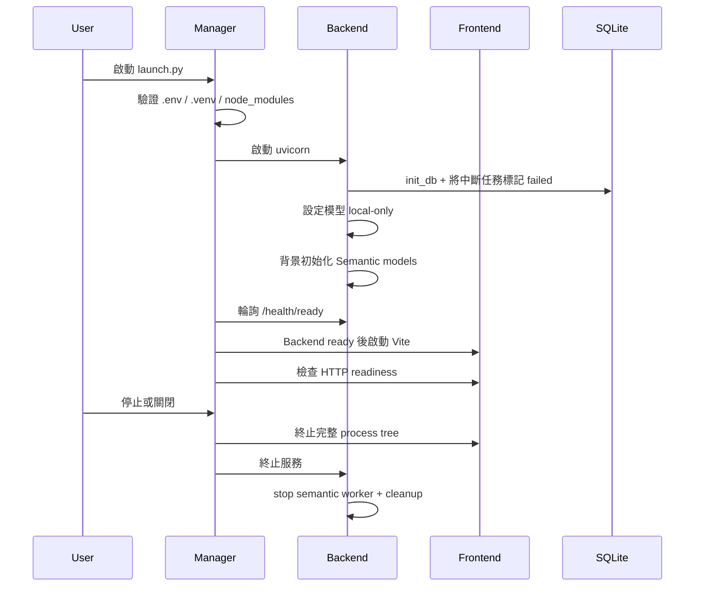
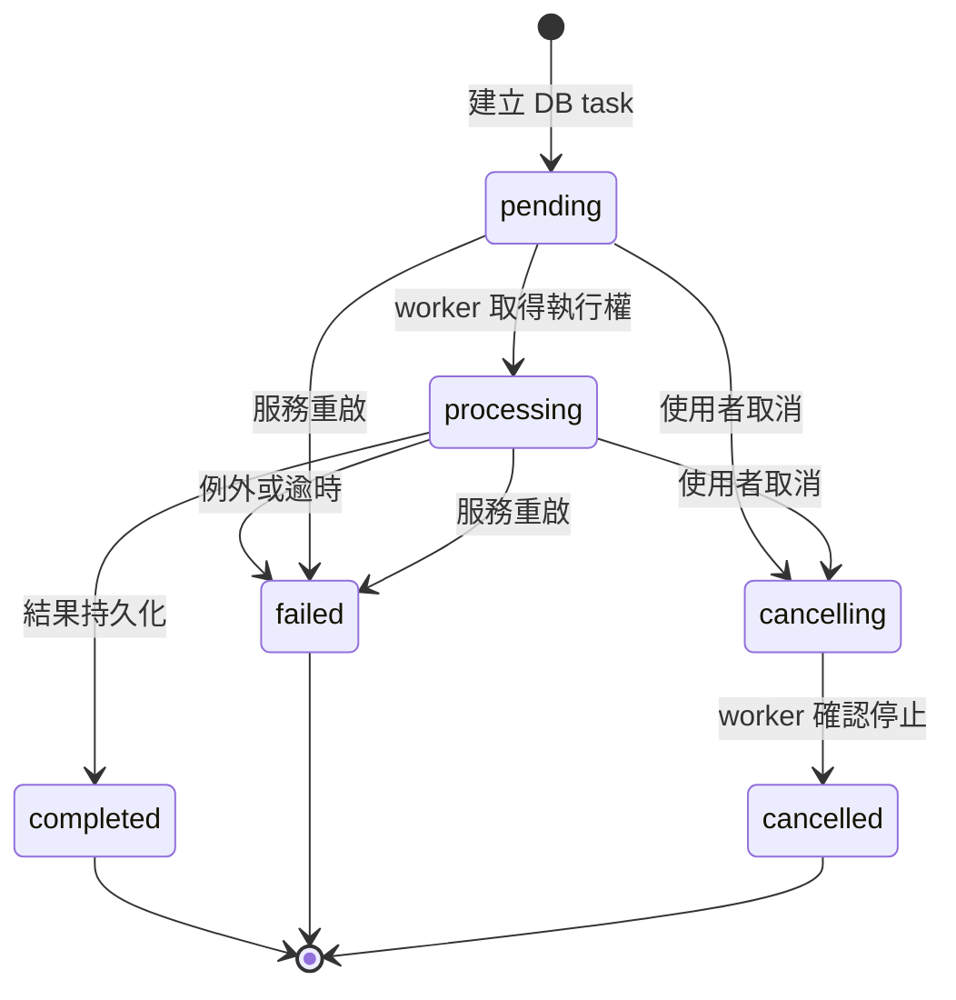

# 架構與生命週期

## 設計目標

Omni AI Manager 是單機、Windows 優先的多模態工作站。核心設計是將「可能連網且會改變環境的管理動作」與「只使用本機資產的推論動作」分離，並由桌面 Manager 統一監督 Backend 與 Frontend。

## 元件責任

| 元件 | 責任 | 不負責 |
| --- | --- | --- |
| `launch.py` | 找到專案根目錄、封裝版自動 clone、確保 Manager 最小依賴、啟動 GUI | AI runtime 安裝與模型推論 |
| `manager/` | `.venv`、npm、FFmpeg、模型、設定、Git 更新、程序健康檢查、重啟與 log | 對外 API 與任務內容 |
| `backend/` | JWT、FastAPI、SQLite、上傳、任務狀態、AI provider/engine、匯出 | 默默下載缺少的模型 |
| `frontend/` | 登入、模型狀態、任務操作、SSE 進度、媒體播放、結果編修與匯出 | 保存權威任務狀態 |
| Hugging Face cache | 已下載模型 snapshot 與權重 | 專案原始碼版本控制 |

## 服務啟停

Manager 以 PID、command、cwd 與 log path 驗證既有程序，合法時可在 GUI 重啟後採用；Windows 停止服務使用完整 process tree，避免 `npm.cmd` 結束但 Vite 留在背景。readiness 失敗達門檻後才觸發有界自動重啟，避免無限 crash loop。

## ASR 任務生命週期

本機上傳先經副檔名、空檔與大小驗證，再以分塊方式寫入 `uploads/`。背景 thread 進入程序內 ASR 全域鎖，以隔離的 temporary workspace 執行轉檔、切片、Qwen ASR、Forced Alignment、語者分離與後處理。取消與逾時在等待鎖、轉檔、generation 與結果寫入前皆有檢查；終態寫入 SQLite 後清理記憶體進度與暫存資產。

程序內鎖只適用單一 Uvicorn process。若改成多 worker 或多節點，必須把 GPU 工作移到 durable queue，並使用跨程序鎖與外部狀態儲存。

## 模型生命週期

1. `backend/model_registry.py` 是模型 key、ID、分類與 gated 屬性的單一 registry。
2. Manager 檢查 cache，缺少時用獨立 worker 執行 Hugging Face snapshot download。
3. 下載進度最高先保留 99%，snapshot 完整驗證後才標示完成。
4. Backend 啟動時設定 Hugging Face/Transformers offline，功能呼叫只讀本機 cache。
5. provider 在第一次需要時載入模型並重用；OCR 可明確 unload，Backend shutdown 清理 semantic worker。

Windows 不允許 symlink 時，下載器會退回普通檔案 copy；cache 判定會檢查權重、sharded index 與 main revision，而非只看目錄存在。

## 前端資料流

登入取得的 JWT、角色與 owner ID 儲存在 browser localStorage。一般 REST 使用 `Authorization: Bearer`；原生 `EventSource`、媒體與下載視窗因 API 限制使用 query token。API 以 owner ID 限制任務與媒體。Frontend 每 30 秒更新模型狀態，任務頁以 SSE 顯示進度，SQLite 才是跨重啟的權威狀態。

## 資料與信任邊界

| 資產 | 位置 | 性質 |
| --- | --- | --- |
| 環境 Secret | `.env` | 不提交、不寫 log |
| Manager 設定 | `manager_config.json` | 非 Secret，但會影響 bind address 與監督策略 |
| 任務／使用者 | `omni_ai.db` | 可能含 Email、檔名、辨識文字 |
| 原始媒體 | `uploads/` | 高敏感、應設定保存期限 |
| 推論結果 | `results/` | 可能含字幕、OCR 與中間檔 |
| 程序 log/record | `.manager/` | 可能含路徑與錯誤內容 |
| 模型 | Hugging Face cache | 大型供應鏈資產、適用上游授權 |

JWT 保護高成本推論 API；登入、health、root 與 read-only system status 保持公開以支援啟動與監控。這仍不是完整公網防線，部署限制請見 [SECURITY.md](../SECURITY.md)。
