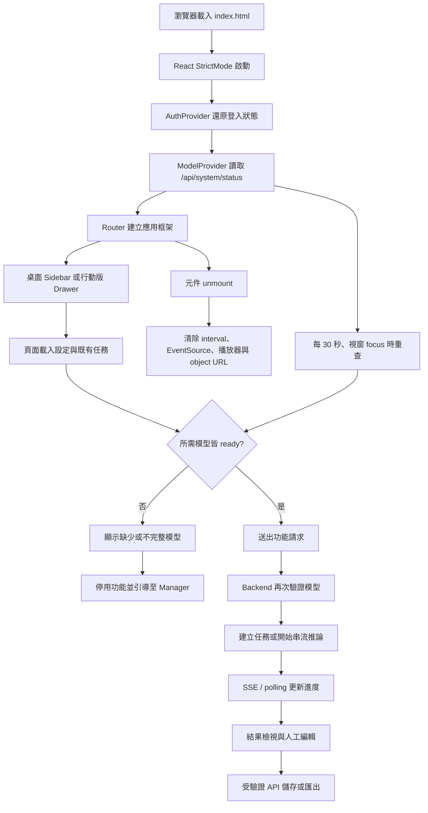

# Frontend 完整生命週期研究與 UI/UX 優化報告

日期：2026-07-19  
範圍：React/Vite 前端、FastAPI 功能入口、Manager 模型管理整合、ASR 字幕編輯

## 摘要

原本前端把「瀏覽器是否連線」、「Hugging Face 是否可達」與「模型是否已下載」混成同一個 offline 狀態。未知模型甚至會被預設為可用，只有判定離線時才阻擋缺少模型的功能。這使 UI 呈現與真正能力不一致，也保留了首次使用功能時才下載大型模型的舊生命週期。

本次改為能力導向生命週期：Manager 是唯一模型下載入口；Frontend 定期讀取本機模型狀態，依當前功能所需模型顯示 ready、missing、partial 或狀態讀取失敗；只要必要模型未 ready，操作就會 fail closed。Backend 同時在接收大型檔案或建立背景任務前做相同檢查，推論載入器只讀本機快取，因此繞過 UI 也不會觸發下載。

ASR 的 LLM 校對介面、provider、API、Manager 類別、API key 設定及套件依賴已移除。人工字幕編輯保留，並移到有身分與任務所有權驗證的 `PUT /api/tasks/{task_id}/sentences`。

## 前端完整生命週期

### 1. Bootstrap 與全域狀態

- `main.jsx` 掛載 Router、AuthProvider 與 ModelProvider。
- ModelProvider 啟動後立即取得 `/api/system/status`，請求有 8 秒 timeout。
- 每 30 秒及視窗重新取得焦點時更新模型狀態；unmount 時清除 interval 與 focus listener。
- 模型狀態讀取失敗時採 fail closed，不把未知狀態當作可用。
- 應用框架在桌面顯示分組導覽；窄螢幕改用 header、drawer 與 backdrop，補回原本行動版無法開啟側欄的缺口。

### 2. 認證與路由

- 既有登入 token 由 AuthProvider 管理；受保護請求透過 `fetchWithAuth`。
- 任務建立、查詢、取消、字幕儲存及匯出皆延續使用登入身分。
- 新增 skip link、鍵盤 focus 樣式、語意化狀態區與 404 頁面。
- EventSource 無法附 Authorization header，現有進度串流仍以 query token 傳送；這是後續應改用 HttpOnly cookie 或短效串流票證的安全技術債。

### 3. 頁面與功能狀態

各功能不再詢問「現在是否離線」，而是詢問「這個操作所需模型是否完整存在」。遠端 OCR provider 不要求本機 OCR 模型，但 CLIP-OCR 工作流仍一定需要 CLIP。

| 前端功能 | 必要本機模型 | 動態條件 |
|---|---|---|
| 新增 ASR 任務 | 選定的 `asr_1.7b` 或 `asr_0.6b`、`forced_aligner` | 啟用語者分離時再需要 `diarization` |
| SubSync | 選定的 ASR、`forced_aligner` | 不使用語者分離 |
| ClipSearch | `clip` | 無 |
| 向量提取 | `clip` | 無 |
| OCR | `glm_ocr` | 只限 local provider；文件版面模式另需 `pp_doclayout` |
| CLIP + OCR | `clip` | local OCR 再需要 `glm_ocr` |
| Semantic Embedding | `bge_embedding` | 隨目前 tab 切換 |
| Semantic Rerank | `bge_reranker` | 隨目前 tab 切換 |

### 4. 任務執行、結果與清理

- 建立任務前先做前端能力檢查；Backend 在儲存 upload 前再檢查，避免浪費 I/O。
- 背景 ASR 以 SSE 回報，完成後重新抓取持久化結果；中斷時以既有 DB fallback 恢復狀態。
- 字幕可雙擊人工編輯、復原、重新分句、移除標點、儲存及匯出，不再送到第三方 LLM。
- VectorExtractor 的 preview object URL 在替換檔案及 unmount 時釋放。
- SubSync 的 YouTube/local player、timer 與 EventSource 於狀態切換或 unmount 時清理。

## 模型生命週期整合

### 狀態來源

`backend/model_registry.py` 是模型 key、顯示名稱與實際 model ID 的單一來源。`/api/system/status` 只回傳本機模型及 ASR runtime 狀態，不再執行 Hugging Face 網路探測。每個模型由共享 cache inspector 判定：

- `ready`：存在可用 snapshot，權重與 shard index 完整，`refs/main` 可解析。
- `partial`：目錄存在但權重、元件或 revision 不完整。
- `missing`：沒有可用本機 snapshot。

### 防止功能觸發下載

1. Frontend 的 `ModelRequirement` 顯示缺少模型與 Manager 操作指引並停用按鈕。
2. Backend 的 `model_availability` 在 ASR、YouTube、CLIP、OCR、Workflow、Semantic 路由做功能級 preflight，缺少模型回傳 HTTP 409。
3. Backend 啟動時固定設定 Hugging Face/Transformers local-only 環境。
4. ASR、Forced Aligner、CLIP、GLM-OCR 的 `from_pretrained` 額外指定 `local_files_only=True`；語者分離先做完整 cache 檢查並受全域 local-only 環境保護。
5. Semantic 背景初始化只載入已存在的模型，不再記錄「無快取將自動下載」。
6. Manager 的下載 worker 仍可在自己的受控程序解除 local-only、下載、回報進度並驗證 snapshot。

這讓「下載」和「推論」成為兩個清楚、可觀測且不互相偷渡的生命週期。

## ASR LLM 校對移除

已移除項目：

- TaskDetail 與 SubSync 的 provider、model、temperature、max tokens、thinking 等設定 UI。
- 前端處理、取消、進度與 `/api/llm/*` 呼叫。
- `backend/routers/llm.py`、`backend/llm_manager.py`。
- `.env.example` 的 `OPENAI_API_KEY`、`GEMINI_API_KEY`。
- `requirements.txt` 的 `openai`、`google-genai`。

保留的 `OCR_PROVIDER=openai` 是 OpenAI-compatible OCR transport，用於 vLLM/SGLang，與已移除的 ASR LLM 校對無關。

原先 `/api/llm/save` 同時承擔人工字幕儲存，而且 LLM router 沒有掛上全域 auth dependency。新 API 會驗證登入者擁有該任務、阻擋任務執行中修改、限制字幕段數與單段文字長度，再持久化人工編輯。

## UI/UX 優化

### 全域框架

- 導覽依「語音與字幕、視覺與文件、任務與紀錄」分組，降低功能掃描成本。
- Sidebar footer 常駐顯示模型 ready 數量、最後更新時間與手動重新整理。
- 行動版有可操作 drawer，不再直接隱藏唯一導覽。
- 加入一致的 loading、error、empty、not-found 與 disabled 狀態。
- 補上 `:focus-visible`、reduced-motion、ARIA live region、可鍵盤操作的 upload zone。

### 功能回饋

- 缺少模型時直接列出模型名稱與 partial/missing 狀態，而不是顯示籠統的離線 banner。
- 按鈕 disabled 與提示文字使用同一份能力判定，避免 UI 看似可按但請求必敗。
- 設定讀取與功能請求錯誤改為頁內訊息與 retry，主要任務建立流程不再依賴 alert。
- Semantic API 改用相對路徑並由 Vite proxy 轉送，不再硬編碼 `localhost:8000`，可支援 Manager 自訂 host/port 與同源部署。

## 問題分級與處理結果

| 等級 | 問題 | 影響 | 狀態 |
|---|---|---|---|
| P0 | 功能首次執行會下載模型 | 長時間等待、timeout、不可預測流量 | 已完成：Manager-only download + local-only inference |
| P0 | 未知模型預設可用且只在 offline 阻擋 | 缺模型仍能提交工作 | 已完成：能力狀態 fail closed、前後端雙層 guard |
| P1 | ASR LLM 校對與設定仍存在 | 維護兩套 provider、金鑰與第三方資料傳輸面 | 已移除 |
| P1 | 人工字幕儲存掛在未驗證 LLM router | 可能修改非本人任務 | 已完成：受驗證 tasks API 與 owner check |
| P1 | 行動版直接隱藏 sidebar | 小螢幕無法導覽 | 已完成：mobile drawer |
| P1 | Semantic 硬編碼 backend URL | 自訂 port/部署失敗 | 已完成：相對 URL + proxy |
| P2 | 模型狀態散落於頁面 | 顯示與停用邏輯不一致 | 已完成：ModelProvider 與共用元件 |
| P2 | upload zone、focus、動態狀態可及性不足 | 鍵盤與輔助科技體驗差 | 已改善 |

## 驗證結果

- Frontend production build：Vite 6.4.3，58 modules，成功。
- Python `compileall`：backend、manager、tests 成功。
- 針對 Manager lifecycle、模型管理與 OCR：46 tests passed，2 skipped。
- 模型測試新增功能 guard 的 missing/ready 判斷、model ID 對 registry key 映射；OCR 測試確認 processor 與 model 都使用 `local_files_only=True`。
- 完整 `unittest discover` 在 Codex bundled Python 仍有環境型失敗：缺少 `soundfile`、`requests`、`fastapi`，以及 Windows cp950 無法輸出既有測試的 emoji；這些不是本次程式斷言失敗。專案 `.venv` 目前指向已移除的 Python，需由 Manager 重建後再跑完整整合測試。

## 後續建議

1. 把 EventSource query token 改成 HttpOnly SameSite cookie 或一次性、短效串流 ticket，避免 token 出現在 URL、history 或 proxy log。
2. 為各功能加入 FastAPI TestClient contract tests：缺模型回 409、模型 ready 才接受 upload、remote OCR 不要求 `glm_ocr`。
3. 將目前散落於頁面的 alert/confirm 全部收斂為共用 toast 與 modal，並加入 destructive action 的 loading/undo 回饋。
4. 任務列表可由固定 3 秒 polling 升級為可見頁面才輪詢，或整合單一事件通道，減少背景請求。
5. Manager 新增模型時，要求同一個變更同時包含 registry、前端顯示名稱、功能依賴映射與 contract test，避免能力表漂移。
