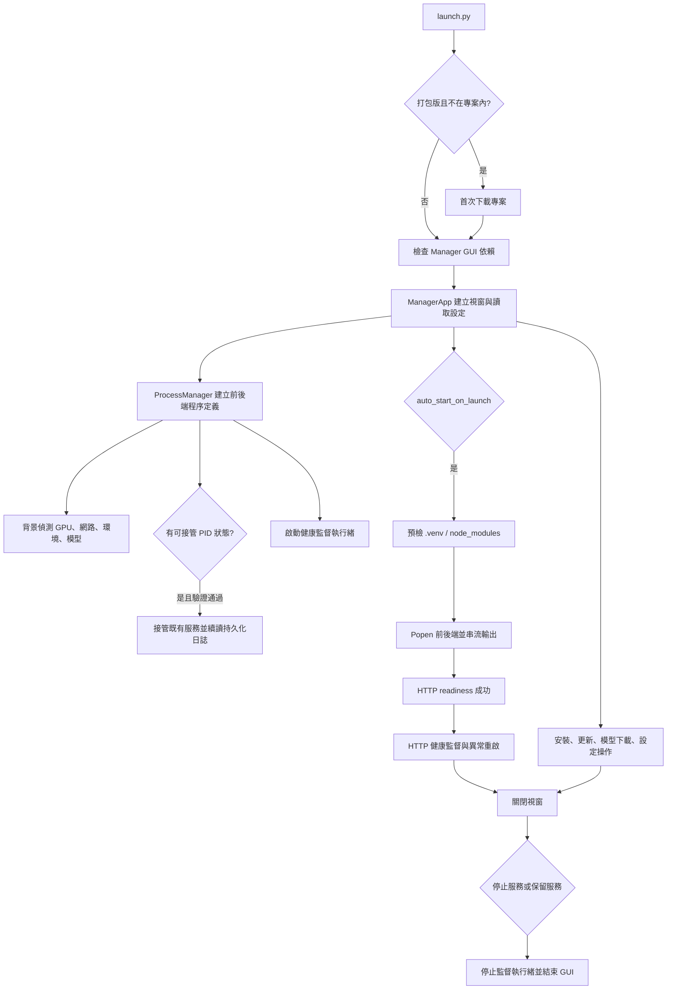

# Manager 完整生命週期研究與優化報告

日期：2026-07-19

## 結論

Manager 已具備安裝環境、啟停前後端、程序輸出、基本存活監控、更新、設定與關閉處理，但原本不是完整的服務控制面：模型只能在功能首次執行時被動下載；模型檢查只判斷 `snapshots/` 是否非空；程序啟動成功被過早視為服務可用；設定更新、監督意圖與實際程序狀態也沒有完整同步。

本次已完成模型預下載、存在性檢查、結構化下載進度與取消，也補齊 HTTP readiness/health supervision、安全首次部署、持久化日誌、PID 接管與 Git 更新前置檢查。Manager 現在能區分「程序已建立」與「服務已就緒」，在 GUI 關閉後保留服務，並於下次啟動驗證 PID、建立時間、命令、工作目錄與健康端點後重新接管。

實機下載又發現一項 P0 整合漂移：Manager 把 PP-DocLayoutV3 當成 PaddleX 模型並呼叫未宣告的 `paddlex.create_model()`，但專案固定的 `glmocr 0.1.5` 實際透過 Transformers 載入 `PaddlePaddle/PP-DocLayoutV3_safetensors`。因此第 9 個模型必然出現 `No module named 'paddlex'`，即使補裝 PaddleX，下載位置與格式也不是 Backend 的實際讀取來源。本次已把 registry、下載 worker、快取檢查、GUI 與文件統一為同一個 Hugging Face checkpoint，並以 133,289,651 bytes 的實際下載完成端到端驗證。

## 生命週期盤點



### 1. Bootstrap 與首次部署

- `launch.py` 在原始碼模式檢查 `ttkbootstrap`、`python-dotenv`、`psutil`，缺少時使用目前 Python 安裝。
- 打包版若不在專案目錄，會要求使用者選擇父目錄，再以 `git clone --depth 1` 建立全新的 `Omni-AI-GUI`；不再對未知或非空目錄執行 `git init`、`fetch`、`reset --hard`。
- 打包後的 EXE 仍從原位置載入 `_internal`，並透過 `--project-dir` / `OMNI_AI_PROJECT_ROOT` 指向外部專案，避免把 EXE 當成已搬移到 clone 目錄。
- Manager 的 `.venv` 與實際 Backend 執行環境分離；這個邊界是合理的，GUI 即使 Backend 環境損壞仍可修復它。
- 現況已能辨識「`.venv/python.exe` 檔案仍在，但基礎 Python 已移除」的損壞環境。

### 2. GUI 初始化

- 載入並合併 `manager_config.json`。
- 建立狀態、控制、Console、安裝/更新、設定、系統資訊分頁。
- 建立 `ProcessManager`、啟動背景系統偵測與健康監督。
- 依設定排程自動啟動 Backend/Frontend。

### 3. 環境建置與更新

- Python：建立 `.venv`、依 GPU 平台產生暫存 requirements、安裝依賴。
- Frontend：檢查 Node/npm 並執行 npm install。
- FFmpeg：獨立下載與解壓。
- Git：檢查更新與 pull。
- 完整重裝：停止服務、移除 `.venv`/`node_modules`、重新建置。

### 4. 程序啟動、運行、異常與重啟

- Backend 以 `.venv/python -m uvicorn backend.app:app` 啟動。
- Frontend 以 `npm run dev` 啟動，連接資訊由環境變數傳入 Vite。
- Backend 提供 `/health/live` 與 `/health/ready`；Manager 只有在 HTTP readiness 成功後才切換為 Running。執行中連續健康失敗達門檻才重啟，避免單次抖動造成重啟風暴。
- stdout/stderr 合併寫入 `.manager/logs/backend.log`、`frontend.log`，同時由背景執行緒追蹤並顯示於 Console；單檔達 10 MiB 會保留一份輪替檔。
- 本次新增「期望運行」狀態，將使用者意圖與 PID/畫面狀態分離。程序異常退出後仍可由 supervisor 判斷應否重啟；手動停止則不再被誤重啟。
- 啟停操作已序列化，避免快速重複點擊產生兩個相同服務。
- 連續重啟達上限後會停止監督該程序，而不是每個週期重複報錯。
- Windows 終止時直接以仍存活的 npm/uvicorn 根 PID 執行 `taskkill /F /T`，確保 Node/Vite 等子程序不會在父程序先退出後成為孤兒；其他平台先優雅終止，超時才強制終止。
- Vite 啟用 `strictPort`，指定埠被占用時會明確啟動失敗，不再靜默改用 5175、5176 而讓 Manager 的健康端點與實際服務錯位。

### 5. 設定生命週期

- 設定載入會驗證布林值、連接埠、時間與行數範圍。
- 設定改用暫存檔、flush/fsync、`os.replace` 原子更新，降低中斷寫入造成 JSON 損壞的風險。
- 儲存後立即重載 ProcessManager 的命令與環境；新設定於下次啟動或重啟套用，不必關閉 Manager。
- 新增啟動就緒逾時、健康探針逾時與連續失敗門檻；非法值會回復安全預設。

### 6. 關閉生命週期

- 關閉時若服務仍運行，使用者可選擇停止全部、保留服務或取消。
- 停止全部會先停止 supervisor，再終止子程序。
- 本次加入 supervisor thread 的有限 join，避免 GUI 銷毀後背景監控仍短暫操作狀態。
- 選擇保留服務時，子程序直接持有持久化日誌檔，不依賴 GUI 的 pipe；Manager 以原子 JSON 保存 PID 與建立時間。
- 下次啟動只接管 PID、建立時間、服務命令、工作目錄、日誌路徑與 HTTP 健康皆相符的程序；stale/偽造或已失效的紀錄只會忽略，不會誤殺未知程序。

## 模型生命週期

```mermaid
flowchart LR
    R[共享 model_registry] --> C[Hub snapshot 與權重完整性檢查]
    R --> D[Manager 選擇模型]
    D --> W[.venv model_downloader]
    W --> S[snapshot_download 完整倉庫]
    S --> V[local_files_only 驗證]
    V --> C
    C --> API[/api/system/status]
    C --> UI[Manager 已存在/缺少/不完整]
    R --> E[ASR / OCR / CLIP / Semantic 載入器]
```

### 已納管模型

| 功能 | 模型 |
|---|---|
| ASR | `Qwen/Qwen3-ASR-1.7B-hf`、`Qwen/Qwen3-ASR-0.6B-hf` |
| 時間對齊 | `Qwen/Qwen3-ForcedAligner-0.6B-hf` |
| 語者分離 | `pyannote/speaker-diarization-community-1`（需要 token 與授權） |
| 以圖搜頁 | `openai/clip-vit-large-patch14` |
| Semantic | `BAAI/bge-reranker-v2-m3`、`BAAI/bge-m3` |
| OCR | `zai-org/GLM-OCR` |
| OCR 版面 | `PaddlePaddle/PP-DocLayoutV3_safetensors`（Transformers、選用） |

### 存在性判定

原判定只要 `snapshots/` 內有任何項目即回傳 `cached=true`，中斷下載、空 snapshot、損壞 symlink 或 `refs/main` 指向不存在 revision 都可能被誤判。本次改為：

1. Hugging Face 模型依 `HF_HUB_CACHE`、舊版 `HUGGINGFACE_HUB_CACHE`、`HF_HOME`、預設目錄順序解析快取。
2. 驗證模型 repo、snapshot、可讀檔案、模型權重與 `refs/main` 指向；只有設定檔而沒有權重不再視為 ready。
3. 掃描 `*.incomplete` 與 broken symlink。
4. 回傳 `ready`、`partial`、`missing`，並保留舊版 API 的 `cached` 布林欄位。
5. Hugging Face 主動下載使用 `snapshot_download()` 取得完整 repository；完成後再以 `local_files_only=True` 驗證。
6. PP-DocLayoutV3 使用與 `glmocr 0.1.5` 預設設定相同的 `PaddlePaddle/PP-DocLayoutV3_safetensors`；Manager 與 Backend 共用 Hugging Face cache，不再依賴或顯示未使用的 PaddleX cache。
7. 下載工作器以 JSONL 事件回報模型、已完成位元組、總位元組、百分比與驗證階段；舊版 Hub 無法預估總量時改顯示不確定進度。
8. GUI 可取消目前工作器；已下載的 Hub blob 保留，下一次可續用快取，不會把部分下載誤標成完成。

Hugging Face 官方說明指出，Hub cache 由 `refs`、`blobs`、`snapshots` 組成；`snapshot_download()` 用於下載整個 revision，Windows 不支援 symlink 時會直接把檔案存入 snapshot。本實作同時相容兩種布局。新版 Hub 也能利用 cached file list 對不完整 snapshot 產生錯誤；本地檔案檢查則提供舊版相容的第二層防線。

參考資料：

- [Hugging Face：Downloading files](https://huggingface.co/docs/huggingface_hub/package_reference/file_download)
- [Hugging Face：Understand caching](https://huggingface.co/docs/huggingface_hub/en/guides/manage-cache)
- [GLM-OCR 官方 GitHub](https://github.com/zai-org/GLM-OCR)
- [Transformers：PP-DocLayoutV3](https://huggingface.co/docs/transformers/model_doc/pp_doclayout_v3)
- [PaddlePaddle：PP-DocLayoutV3 safetensors 模型卡](https://huggingface.co/PaddlePaddle/PP-DocLayoutV3_safetensors)

## 缺口、風險與處置

| 優先級 | 缺口 | 影響 | 本次狀態 |
|---|---|---|---|
| P0 | PP-DocLayoutV3 下載 provider 與 runtime 不一致 | 固定在第 9 個模型因缺少 `paddlex` 失敗；即使安裝也不是 Backend 使用的 checkpoint | 已完成，統一為 Transformers/HF checkpoint 並實際下載驗證 |
| P0 | 無法預先下載模型 | 第一次執行功能才下載，長任務容易超時或失敗 | 已完成 |
| P0 | 模型快取僅檢查非空目錄 | 中斷下載可能被誤判為存在 | 已完成 |
| P1 | 模型 ID 分散硬編碼 | ASR/OCR/狀態清單容易漂移 | 已完成，共享 registry |
| P1 | 快速重複啟停可競爭 | 可能產生重複程序或錯誤狀態 | 已完成，操作序列化 |
| P1 | PID 狀態與使用者運行意圖混用 | 意外退出與手動停止難以正確監督 | 已完成，新增 desired state |
| P1 | 儲存設定後命令仍是舊值 | 需要重開 Manager 才能換 port/host | 已完成，熱重載命令 |
| P1 | 設定直接覆寫 JSON 且缺乏驗證 | 中斷或非法值會破壞下次啟動 | 已完成，驗證與原子寫入 |
| P1 | `Popen` 成功即顯示 Running | 服務可能仍在啟動或已無法 HTTP 回應 | 已完成，HTTP readiness |
| P1 | Windows 只終止 npm 父程序 | Node/Vite 子程序殘留並持續占用 5174、5175、5176 | 已完成，原子終止完整程序樹並啟用 Vite strictPort |
| P1 | 打包版首次部署執行 `git reset --hard` | 目錄內既有檔案可能被覆蓋 | 已完成，全新目錄 shallow clone |
| P2 | 模型下載只有串流文字 | 無總位元組百分比、階段與取消 | 已完成，JSONL 事件與取消 |
| P2 | 健康監控只看 PID | deadlock 或 HTTP 掛起無法發現 | 已完成，連續失敗門檻與 `/health/*` |
| P2 | Console 只存在 GUI 記憶體 | 關閉 GUI 後無法診斷保留服務 | 已完成，持久化與輪替日誌 |
| P2 | Git pull 未與 dirty worktree/服務運行完整協調 | 更新可能衝突或載入新舊混合程式 | 已完成，dirty/running preflight |
| P3 | 保留服務後關閉 GUI 無法重新接管既有 PID | 下次開啟可能因 port 衝突而失敗 | 已完成，PID/create-time/command/health 驗證接管 |

## 驗證結果

- 全套 `unittest discover` 以 UTF-8 模式執行 58 項測試，58 項全部通過；Manager lifecycle 16 項與 model management 17 項針對性測試，共 33 項全部通過。
- Manager headless 測試使用臨時 HTTP server 驗證 wildcard URL、readiness 成功、readiness timeout、持久化日誌、接管與停止契約、命令白名單、設定原子存取、dirty worktree 阻擋更新。
- 模型測試涵蓋 Hugging Face 的 missing/ready/partial/config-only/broken-ref、cache 優先序、layout checkpoint 派送、registry 唯一性、JSONL event parser、取消控制器與損壞 `.venv` 阻擋下載。
- Python 語法編譯通過。
- Frontend production build 通過（Vite 6.4.3，58 modules）。
- Windows 預設 CP950 下，既有的 `test_merge.py`、`test_split.py` 會在 import 階段直接輸出 emoji，須用 `python -X utf8 -m unittest discover ...`；這是測試啟動環境限制，不是產品程式失敗。
- 較早的模型驗證階段在 `.venv` 尚可執行時，已用 Manager worker 實際下載並完成 `PaddlePaddle/PP-DocLayoutV3_safetensors` 的 `local_files_only` 驗證，快取 revision 為 `97d101e6db2642e162a1d05392d1b0231c91033e`。
- 下載後在 `HF_HUB_OFFLINE=1` 與 `TRANSFORMERS_OFFLINE=1` 下，`glmocr` 成功把模型載入為 `PPDocLayoutV3ForObjectDetection` 並配置到 `cuda:0`，確認快取可被實際 runtime 使用。
- Windows 前端實機 smoke test：Vite 在 5174 啟動後由 Manager 停止，連線結果為 `10061`（拒絕連線），確認埠已釋放；另以暫時服務占用 5174，Vite 明確回傳 `Port 5174 is already in use` 並以 code 1 結束，未改用 5175。
- 最新 Manager lifecycle 測試以獨立 runtime 執行 25 項：24 通過、1 項因該 runtime 未安裝 FastAPI 而跳過；程序樹、strictPort 與語法編譯均通過。
- 目前 `.venv` 的基礎 `Python312` 已被移除，因此 `.venv` 暫時不可執行；本輪改用工作區獨立 Python 驗證，不對既有 `.venv` 做破壞性重建。

## 後續維護原則

1. 變更服務啟動參數時，同步更新 readiness contract 與 headless lifecycle tests。
2. 新增本機模型時只修改共享 `model_registry`，並為 provider 補上下載與 cache 驗證測試。
3. 發佈前在 Python 3.12 `.venv` 執行一次 Backend live/ready smoke test，以及至少一個小型模型的實際下載/取消/續傳測試。
4. CI 在 Windows 應固定啟用 Python UTF-8 mode，避免既有手動驗證腳本的 emoji 輸出受系統 code page 影響。
